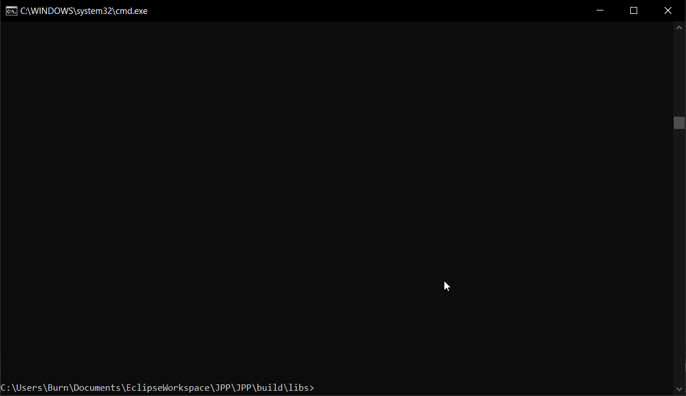

# JavaEasyTester

**JavaEasyTester** (or**JET**) is a program that allow you to easily run simple java programs whithout managing main classes or methods.

for example, there, a simple program:

    import java.util.*;
    public class Main{
	    public static void main(String... args){
		    Scanner sc = new Scanner(System.in);
		    String line;
		    System.out.println("waiting for lines...");
		    while((line = sc.nextLine()) != null) {
			    System.out.println("in: "+line);
			    if(line.equalsIgnoreCase("exit"))break;
			}
		}
	}

and there, the same program with **JET**:

    import java.util.*;
    Scanner sc = new Scanner(System.in);
    String line;
    System.out.println("waiting for lines...");
    while((line = sc.nextLine()) != null) {
	    System.out.println("in: "+line);
	    if(line.equalsIgnoreCase("exit"))break;
    }

## Commands

|Command|Description|
|--|--|
|/help|show the list of commands and their usages|
|/[0-9]+|change the selected line|
|/insert|insert new line at the selected one|
|/delete|delete selected line|
|/clear|clear the selected line|
|/clearall|clear the whole code|
|/copy|copy the code to the clipboard|
|/exec (.\*)\*|execute the code (with or without arguments)|
|quit|exit the app|

## Screenshots

Usage example:

